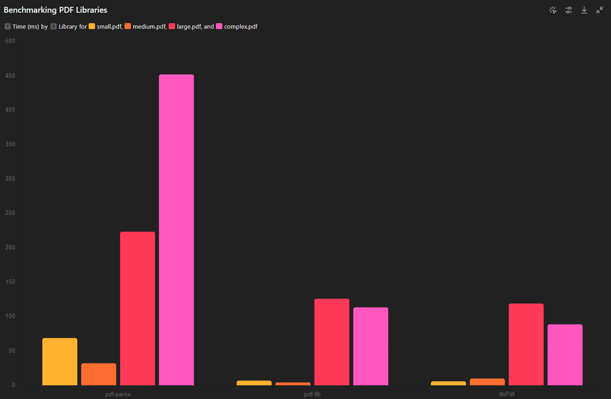

# benchmark

Based on the updated benchmarking results, here are the conclusions:

1. **Small PDFs**:
  - `libPdf` (5.88 ms) and `pdf-lib` (6.81 ms) both performed significantly faster than `pdf-parse` (68.80 ms).
  - `libPdf` showed the best performance with a slight advantage over `pdf-lib`.

2. **Medium PDFs**:
  - `pdf-lib` (4.17 ms) was the fastest, followed by `libPdf` (9.92 ms).
  - `pdf-parse` (32.10 ms) was slower compared to both `libPdf` and `pdf-lib`.

3. **Large PDFs**:
  - `libPdf` (118.92 ms) and `pdf-lib` (125.85 ms) had similar performance, with `libPdf` being slightly faster.
  - `pdf-parse` (223.42 ms) was the slowest for large PDFs.

4. **Complex PDFs**:
  - `libPdf` (88.71 ms) significantly outperformed `pdf-lib` (113.37 ms) and `pdf-parse` (452.17 ms).
  - `libPdf` showed the best performance for complex PDFs, followed by `pdf-lib`.

### Overall Summary:

- **Best Overall Performance**: `libPdf` consistently showed the best performance across different PDF sizes and complexities.
- **Efficient for Small and Medium PDFs**: `pdf-lib` performed very efficiently for small and medium PDFs, closely following `libPdf`.
- **Consistent Performance**: `pdf-parse` demonstrated consistent performance but was generally slower than both `libPdf` and `pdf-lib` across all test cases.
- **Significant Performance Gaps**: The performance gaps between the libraries are more pronounced in larger and more complex PDFs, highlighting the strengths of `libPdf` in handling such documents efficiently.